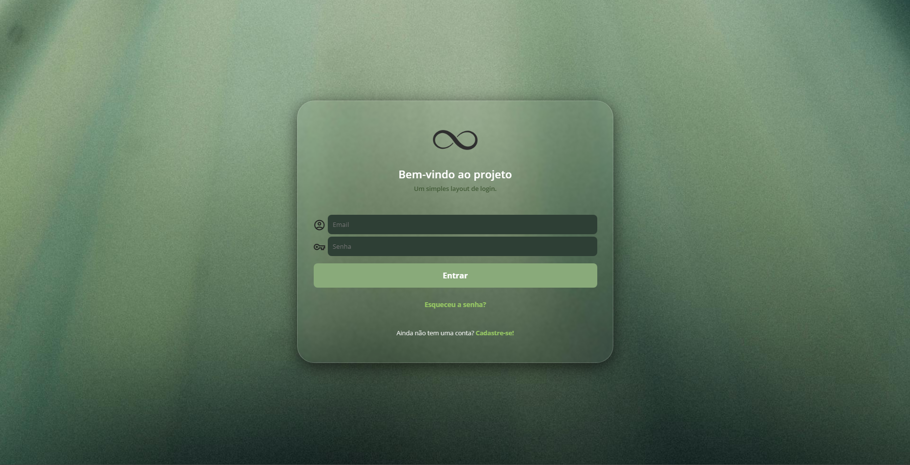

# Project: Simple Login Page


## 📝 Description

This is a simple front-end project consisting of a static login page. The goal was to practice and demonstrate fundamental skills in structuring with **HTML5** and styling with **CSS3**, creating a clean and functional interface.

## 🌐 Live Demo

You can view the live project through the link below:

[**Click here to access the login page**](https://pedrovalete.github.io/pagina-login/teste.html)

## 💻 Preview



### ✨ Features

- Login form with fields for email and password.
- Clean, modern, and centered layout.
- "Sign In" button with a `hover` effect for better interactivity.
- Links for "Forgot my password" and "Create account".
- Basic HTML5 field validation (using the `required` attribute).

## 🚀 Technologies Used

This project was developed using the following technologies:


## 📂 How to Run the Project

As this is a static project, there is no need to install dependencies.

1.  Clone this repository:
    ```bash
    git clone [https://github.com/pedrovalete/pagina-login.git](https://github.com/pedrovalete/pagina-login.git)
    ```
2.  Navigate to the project directory.
3.  Open the `teste.html` file in your preferred browser.

And that's it, the page will be displayed!

## Author

Made by **Pedro Valete**.

[](https://www.linkedin.com/in/pedro-valete-527658380)
[](https://github.com/pedrovalete/)
